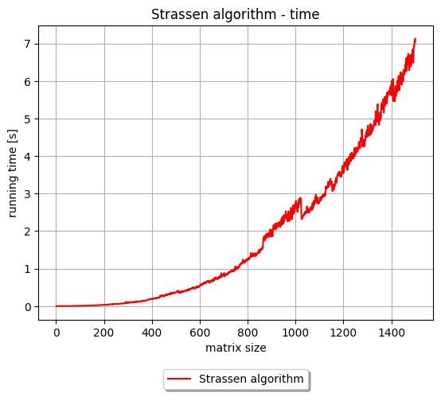
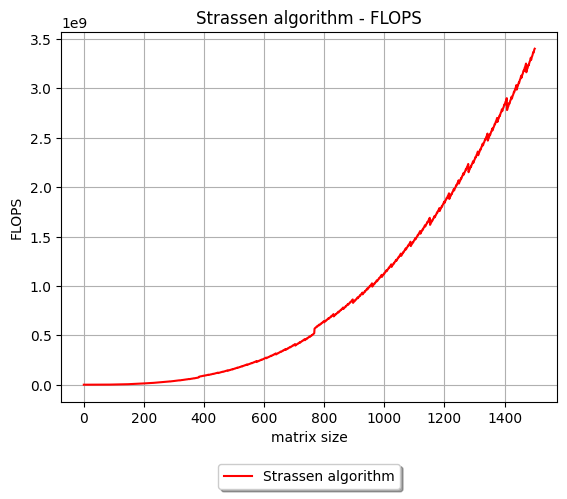
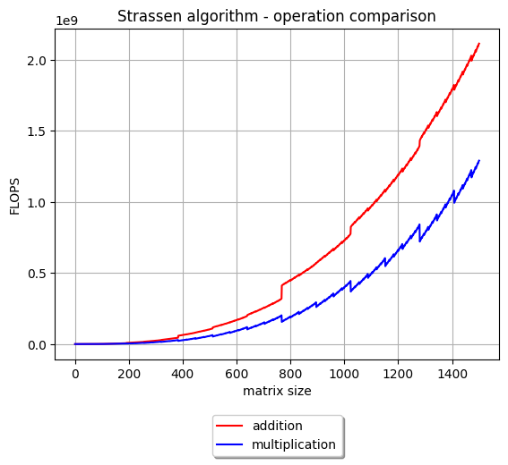

# Strassen algorithm
## Description
[Strassen algorithm](https://en.wikipedia.org/wiki/Strassen_algorithm) for matrix multiplication, implemented using the Go programming language. 

The algorithm supports square matrices of any size as input.
## Results
### Time graph

### FLOPs graph

### Operation comparison graph

